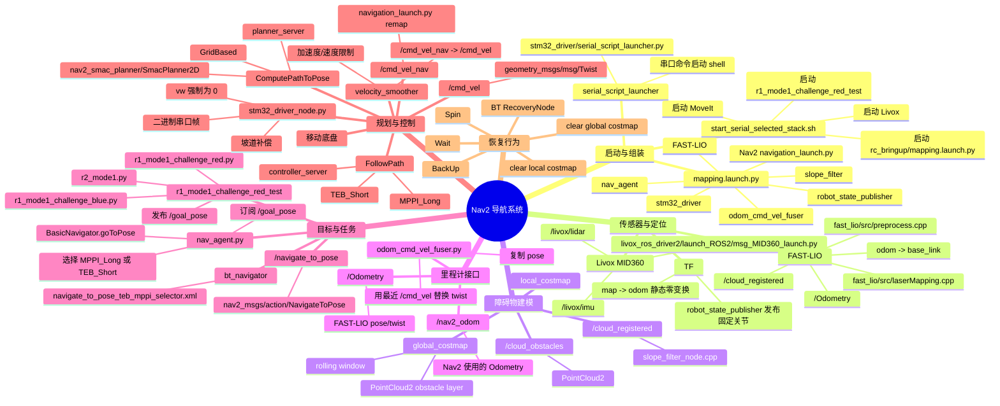

# Nazarite Nav2 流程思维导图与代码索引

> 代码实际位于 `/home/alice/code/Nazarite`，不是当前工作区 `/home/alice/tur_amcl_ws`。
> 本文把“当前实车主入口”和“备用/地图入口”分开。项目没有可用的 Git 历史，因此“代码是以什么顺序写出来的”无法按作者提交时间恢复；下文给出可验证的**运行顺序**和最适合学习的**阅读顺序**。

## 1. 当前实车主链路



### 精确的消息流

```mermaid
flowchart LR
  L[Livox MID360\n/livox/lidar CustomMsg\n/livox/imu Imu] --> F[fastlio_mapping\nFAST-LIO]
  F --> O[/Odometry\nnav_msgs/Odometry]
  F --> C[/cloud_registered\nPointCloud2]
  F --> T[odom -> base_link\n动态 TF]
  C --> S[slope_filter_node]
  S --> CO[/cloud_obstacles\nPointCloud2]
  CO --> LC[local_costmap]
  CO --> GC[global_costmap]
  O --> U[odom_cmd_vel_fuser]
  V[/cmd_vel\nTwist] --> U
  U --> NO[/nav2_odom\nOdometry]
  G[任务状态机\n/goal_pose PoseStamped] --> A[nav_agent]
  A -->|NavigateToPose Action| B[bt_navigator]
  NO --> B
  B --> P[planner_server\nSmacPlanner2D]
  GC --> P
  P --> PATH[Path]
  PATH --> K[controller_server\nMPPI/TEB]
  LC --> K
  NO --> K
  K --> CVN[/cmd_vel_nav\nTwist]
  CVN --> VS[velocity_smoother]
  NO --> VS
  VS --> V
  V --> D[stm32_driver]
  D --> H[底盘]
  B -.恢复.-> R[clear costmap / spin / wait / backup]
```

## 2. 当前主入口对应的代码

### 2.1 启动层

| 顺序 | 文件 | 作用 |
|---|---|---|
| 1 | [`serial_script_launcher.py`](/home/alice/code/Nazarite/src/stm32_driver/stm32_driver/serial_script_launcher.py) | 监听外部串口启动/停止命令；不是 Nav2 节点接口 |
| 2 | [`start_serial_selected_stack.sh`](/home/alice/code/Nazarite/src/stm32_driver/scripts/start_serial_selected_stack.sh) | 启动 Livox、MoveIt、`mapping.launch.py`、任务状态机 |
| 3 | [`mapping.launch.py`](/home/alice/code/Nazarite/src/rc_bringup/launch/mapping.launch.py) | 组合 robot state、里程计 fuser、底盘、Nav2、FAST-LIO、障碍物滤波 |
| 4 | `/opt/ros/humble/share/nav2_bringup/launch/navigation_launch.py` | Nav2 官方启动器，项目通过 include 使用，不在 Nazarite 源码中 |

`mapping.launch.py` 的实际启用项：

- `robot_state_publisher`
- `joint_state_publisher`（可选）
- `odom_cmd_vel_fuser`
- `stm32_driver_node`
- `nav2_agent`
- `fastlio_mapping`
- `slope_filter_node`
- `static_transform_publisher map -> odom`
- Nav2 官方 `navigation_launch.py`
- RViz（可选）

定义但被注释的项目：

- `livox_node`：由 shell 脚本单独启动
- `pointcloud_to_laserscan`
- `slam_toolbox`

### 2.2 传感器、里程计与障碍物

| 功能 | 代码/配置 | 输入 | 输出 |
|---|---|---|---|
| Livox 驱动 | [`msg_MID360_launch.py`](/home/alice/code/Nazarite/src/livox_ros_driver2/launch_ROS2/msg_MID360_launch.py)、[`MID360_config.json`](/home/alice/code/Nazarite/src/livox_ros_driver2/config/MID360_config.json) | MID360 SDK | `/livox/lidar` `CustomMsg`、`/livox/imu` `sensor_msgs/Imu` |
| FAST-LIO | [`laserMapping.cpp`](/home/alice/code/Nazarite/src/fast_lio/src/laserMapping.cpp)、[`preprocess.cpp`](/home/alice/code/Nazarite/src/fast_lio/src/preprocess.cpp) | LiDAR CustomMsg、IMU | `/Odometry`、`/cloud_registered`、TF `odom -> base_link` |
| FAST-LIO 参数 | [`fast_lio.yaml`](/home/alice/code/Nazarite/src/rc_bringup/config/reality/fast_lio.yaml) | topic、LiDAR 类型、外参、滤波参数 | 被 `fastlio_mapping` 读取 |
| 里程计 fuser | [`odom_cmd_vel_fuser.py`](/home/alice/code/Nazarite/src/stm32_driver/stm32_driver/odom_cmd_vel_fuser.py) | `/Odometry`、`/cmd_vel` | `/nav2_odom` |
| 障碍物滤波 | [`slope_filter_node.cpp`](/home/alice/code/Nazarite/src/fast_lio/src/slope_filter_node.cpp) | `/cloud_registered` | `/cloud_obstacles` |
| 机器人 TF | [`model.xacro`](/home/alice/code/Nazarite/src/rc_bringup/urdf/reality/model.xacro) 及其 include 的 xacro | 机器人模型、joint state | `base_link` 到传感器/机械结构的 TF |

### 2.3 Nav2 参数文件

当前实车入口使用：

[`nav2_params_forest_small_teb_mppi.yaml`](/home/alice/code/Nazarite/src/rc_bringup/config/reality/nav2_params_forest_small_teb_mppi.yaml)

该文件配置：

| YAML 区块 | 对应节点/功能 |
|---|---|
| `lifecycle_manager` | 自动激活 controller、planner、behavior、BT、costmap |
| `bt_navigator` | 全局坐标系 `odom`、机器人坐标系 `base_link`、BT XML 路径 |
| `planner_server` | `GridBased -> nav2_smac_planner/SmacPlanner2D` |
| `local_costmap.local_costmap` | `odom` rolling window，订阅 `/cloud_obstacles` |
| `global_costmap.global_costmap` | `odom` rolling window，订阅 `/cloud_obstacles` |
| `controller_server` | `TEB_Short`、`MPPI_Long`、goal checker、odom topic |
| `velocity_smoother` | open-loop、`/nav2_odom`、速度/加速度约束 |

关键参数：

```yaml
bt_navigator:
  ros__parameters:
    global_frame: odom
    robot_base_frame: base_link
    odom_topic: /nav2_odom

planner_server:
  ros__parameters:
    planner_plugins: ["GridBased"]
    GridBased:
      plugin: "nav2_smac_planner/SmacPlanner2D"

local_costmap:
  local_costmap:
    ros__parameters:
      global_frame: odom
      robot_base_frame: base_link
      observation_sources: scan
      scan:
        topic: /cloud_obstacles
        data_type: "PointCloud2"

controller_server:
  ros__parameters:
    odom_topic: /nav2_odom
    controller_plugins: ["TEB_Short", "MPPI_Long"]

velocity_smoother:
  ros__parameters:
    odom_topic: /nav2_odom
    feedback: OPEN_LOOP
```

注意：这里的 observation source 名字叫 `scan`，但真实 topic 是 `/cloud_obstacles`，并不代表当前使用 `/scan`。

### 2.4 行为树

当前 BT 文件：

[`navigate_to_pose_teb_mppi_selector.xml`](/home/alice/code/Nazarite/src/rc_bringup/config/reality/navigate_to_pose_teb_mppi_selector.xml)

逻辑顺序：

```text
RecoveryNode
  -> PipelineSequence
      -> ControllerSelector
      -> GoalCheckerSelector
      -> ComputePathToPose(planner_id=GridBased)
      -> FollowPath(controller_id=selected_controller)
  -> 失败后恢复
      -> 清理 local/global costmap
      -> Spin
      -> Wait
      -> BackUp
```

对应 XML 节点：

```xml
<ControllerSelector topic_name="controller_selector" />
<GoalCheckerSelector topic_name="goal_checker_selector" />
<ComputePathToPose planner_id="GridBased" />
<FollowPath controller_id="{selected_controller}" />
```

### 2.5 任务目标与导航 Action

| 文件 | 作用 |
|---|---|
| [`r2_mode1.py`](/home/alice/code/Nazarite/src/stm32_driver/stm32_driver/r2_mode1.py) | 基础任务状态机，发布 `goal_pose`、处理串口、电控、二维码、到达结果 |
| [`r1_mode1_challenge_blue.py`](/home/alice/code/Nazarite/src/stm32_driver/stm32_driver/r1_mode1_challenge_blue.py) | 蓝方挑战流程派生类 |
| [`r1_mode1_challenge_red.py`](/home/alice/code/Nazarite/src/stm32_driver/stm32_driver/r1_mode1_challenge_red.py) | 红方点位和规则派生类 |
| [`r1_mode1_challenge_red_test.py`](/home/alice/code/Nazarite/src/stm32_driver/stm32_driver/r1_mode1_challenge_red_test.py) | shell 脚本实际启动的测试入口 |
| [`nav_agent.py`](/home/alice/code/Nazarite/src/stm32_driver/stm32_driver/nav_agent.py) | `goal_pose` 到 Nav2 Action 的适配层，控制器切换和结果回传 |

目标链路：

```text
r1_mode1_challenge_red_test
  -> /goal_pose : geometry_msgs/PoseStamped
  -> nav_agent.goal_callback()
  -> BasicNavigator.goToPose()
  -> /navigate_to_pose : nav2_msgs/action/NavigateToPose
  -> bt_navigator Action Server
```

`nav_agent` 的关键代码：

- 初始化 `BasicNavigator`：`nav_agent.py:260`
- 订阅 `/goal_pose`：`nav_agent.py:265`
- 等待 `bt_navigator` active：`nav_agent.py:277`
- 计算距离并切换控制器：`nav_agent.py:572`
- 调用 `goToPose`：`nav_agent.py:669`
- 读取反馈：`nav_agent.py:1238`
- 读取结果并发布 `/agent/arrival_status`：`nav_agent.py:1271`

### 2.5.1 行为树节点调用的 Nav2 Action/Service

行为树 XML 里的标签不是普通函数调用，它们是 Nav2 的 BT 插件；插件再去调用对应的 Nav2 server。

| BT XML 节点 | Nav2 server | 接口类型 | 主要作用 |
|---|---|---|---|
| `NavigateToPose`（BT 根 Action） | `bt_navigator` | `nav2_msgs/action/NavigateToPose` | 对外接收完整导航目标 |
| `ComputePathToPose` | `planner_server` | `nav2_msgs/action/ComputePathToPose` | 根据目标和 costmap 生成 `nav_msgs/Path` |
| `FollowPath` | `controller_server` | `nav2_msgs/action/FollowPath` | 跟踪 `Path`，输出速度 |
| `Spin` | `behavior_server` | `nav2_msgs/action/Spin` | 原地旋转恢复行为 |
| `Wait` | `behavior_server` | `nav2_msgs/action/Wait` | 等待恢复行为 |
| `BackUp` | `behavior_server` | `nav2_msgs/action/BackUp` | 后退恢复行为 |
| `ClearEntireCostmap` | local/global costmap server | `nav2_msgs/srv/ClearEntireCostmap` | 清空局部或全局代价地图 |

当前 XML 中的清图服务名是：

```text
/local_costmap/clear_entirely_local_costmap
/global_costmap/clear_entirely_global_costmap
```

`nav_agent` 自己只直接使用 `BasicNavigator` 的 `NavigateToPose` 客户端；它不直接调用 `ComputePathToPose` 或 `FollowPath`。后两个接口由 `bt_navigator` 通过行为树间接调用。

### 2.6 速度输出与底盘

| 阶段 | 文件/节点 | Topic/数据 |
|---|---|---|
| 控制器输出 | Nav2 `controller_server` | `/cmd_vel_nav`，`Twist` |
| 速度平滑 | Nav2 `velocity_smoother` | 输入 `/cmd_vel_nav`，输出 `/cmd_vel` |
| 底盘节点 | [`stm32_driver_node.py`](/home/alice/code/Nazarite/src/stm32_driver/stm32_driver/stm32_driver_node.py) | 订阅 `/cmd_vel`、`/chassis_mode`、`/Odometry` |
| 串口执行 | `stm32_driver_node.py` | `0xA5 + vx/vy/vw + CRC8 + 0xFF` |

官方 `navigation_launch.py` 的关键 remap：

```text
controller_server:  cmd_vel -> cmd_vel_nav
velocity_smoother: cmd_vel -> cmd_vel_nav
velocity_smoother: cmd_vel_smoothed -> cmd_vel
```

因此不能把 controller 的输出和最终底盘输出都简单写成 `/cmd_vel`。

## 3. Nav2 运行时顺序

这是系统真正运行时的顺序，不是 Python 文件的文本顺序。

### 阶段 0：构建和安装

1. `package.xml` 声明依赖。
2. `CMakeLists.txt` 编译 C++ 节点，例如 `fastlio_mapping`、`slope_filter_node`。
3. `setup.py` 注册 Python executable，例如 `nav2_agent`、`odom_cmd_vel_fuser`、`stm32_driver_node`。
4. `colcon build` 生成 install space。
5. source ROS 2、Nazarite 和其他工作空间。

相关文件：

- [`rc_bringup/package.xml`](/home/alice/code/Nazarite/src/rc_bringup/package.xml)
- [`rc_bringup/CMakeLists.txt`](/home/alice/code/Nazarite/src/rc_bringup/CMakeLists.txt)
- [`fast_lio/CMakeLists.txt`](/home/alice/code/Nazarite/src/fast_lio/CMakeLists.txt)
- [`stm32_driver/setup.py`](/home/alice/code/Nazarite/src/stm32_driver/setup.py)
- 各包自己的 `package.xml`

### 阶段 1：Launch 读取配置

`mapping.launch.py` 先创建 launch 参数：

```text
use_sim_time
use_rviz
use_joint_state_publisher
nav2_params_file
bt_xml_file
```

然后用 `RewrittenYaml` 将参数文件传给 Nav2 官方启动器，并把 BT XML 路径覆盖到 `bt_navigator` 参数。

### 阶段 2：创建传感器和 TF

1. Livox 发布 `/livox/lidar` 和 `/livox/imu`。
2. `robot_state_publisher` 根据 `model.xacro` 发布固定 TF。
3. 静态 TF 发布 `map -> odom`。
4. FAST-LIO 订阅 LiDAR/IMU，发布 `/Odometry`、`/cloud_registered`、`odom -> base_link`。

### 阶段 3：准备 Nav2 状态

1. `odom_cmd_vel_fuser` 把 `/Odometry` 和最近 `/cmd_vel` 组成 `/nav2_odom`。
2. `slope_filter_node` 把 `/cloud_registered` 处理为 `/cloud_obstacles`。
3. local/global costmap 订阅 `/cloud_obstacles`，建立滚动代价地图。
4. lifecycle manager 激活 Nav2 节点。
5. `nav_agent.waitUntilNav2Active(localizer='bt_navigator')` 通过后，导航代理才认为 Nav2 可用。

### 阶段 4：发送目标

1. 任务状态机创建 `PoseStamped`。
2. `header.frame_id` 写为 `odom`。
3. 发布 `/goal_pose`。
4. `nav_agent` 去重、选择 goal checker、选择 MPPI/TEB。
5. `BasicNavigator.goToPose()` 发送 `NavigateToPose` Action Goal。

### 阶段 5：行为树调度

1. `bt_navigator` 接收 Action Goal。
2. 加载 `navigate_to_pose_teb_mppi_selector.xml`。
3. `ControllerSelector` 读取 `/controller_selector`。
4. `GoalCheckerSelector` 读取 `/goal_checker_selector`。
5. `ComputePathToPose` 请求 `planner_server` 使用 `GridBased`。
6. `planner_server` 调用 `SmacPlanner2D`，读取 global costmap，生成 `nav_msgs/Path`。
7. `FollowPath` 把路径交给 `controller_server`。
8. `controller_server` 调用 MPPI 或 TEB，产生 `/cmd_vel_nav`。

### 阶段 6：速度平滑和底盘执行

1. `velocity_smoother` 接收 `/cmd_vel_nav`。
2. 按最大速度、加速度、减速度、超时规则处理。
3. 发布最终 `/cmd_vel`。
4. `stm32_driver_node` 接收 `/cmd_vel`。
5. 读取 `/Odometry` 的 pitch，执行坡道补偿。
6. 把 `vx/vy/vw` 打包成二进制串口帧。
7. 当前代码强制 `vw=0`。
8. STM32 驱动移动底盘。

### 阶段 7：完成和恢复

- 导航成功：`nav_agent` 发布 `/agent/arrival_status=True`。
- 取消或失败：发布 `False`。
- 任务状态机收到结果后继续抓取、扫码、旋转或下一个导航点。
- 规划/跟踪失败：行为树清理 costmap，并尝试 `Spin`、`Wait`、`BackUp`。

## 4. Nav2 相关 YAML/XML/JSON 文件总表

### 当前主链路使用

| 文件 | 用途 | 当前状态 |
|---|---|---|
| [`mapping.launch.py`](/home/alice/code/Nazarite/src/rc_bringup/launch/mapping.launch.py) | 当前实车导航组合入口 | 主入口 |
| [`nav2_params_forest_small_teb_mppi.yaml`](/home/alice/code/Nazarite/src/rc_bringup/config/reality/nav2_params_forest_small_teb_mppi.yaml) | MPPI/TEB、Smac、costmap、smoother 参数 | 主配置 |
| [`navigate_to_pose_teb_mppi_selector.xml`](/home/alice/code/Nazarite/src/rc_bringup/config/reality/navigate_to_pose_teb_mppi_selector.xml) | NavigateToPose 行为树 | 主 BT |
| [`fast_lio.yaml`](/home/alice/code/Nazarite/src/rc_bringup/config/reality/fast_lio.yaml) | FAST-LIO topic 和传感器参数 | 主配置 |
| [`MID360_driver.json`](/home/alice/code/Nazarite/src/rc_bringup/config/reality/MID360_driver.json) | mapping launch 中的 Livox 配置候选 | Livox launch 单独使用另一 JSON |
| [`MID360_config.json`](/home/alice/code/Nazarite/src/livox_ros_driver2/config/MID360_config.json) | shell 启动 Livox MID360 | 主 Livox 配置 |
| [`model.xacro`](/home/alice/code/Nazarite/src/rc_bringup/urdf/reality/model.xacro) | robot_state_publisher 机器人模型 | 主 TF 配置 |

### 备用/另一套 Nav2 入口

| 文件 | 用途 |
|---|---|
| [`bringup.launch.py`](/home/alice/code/Nazarite/src/rc_bringup/launch/bringup.launch.py) | `mapping`/`nav`、仿真/实车、静态 map-odom/Open3D 定位 |
| [`reality/nav2.yaml`](/home/alice/code/Nazarite/src/rc_bringup/config/reality/nav2.yaml) | 传统 MapServer/StaticLayer/地图导航参数 |
| [`simulation/nav2.yaml`](/home/alice/code/Nazarite/src/rc_bringup/config/simulation/nav2.yaml) | 仿真地图导航参数 |
| [`my_2d_map.yaml`](/home/alice/code/Nazarite/src/rc_bringup/map/my_2d_map.yaml) | 2D PGM 地图元数据 |
| `my_2d_map.pgm` | 2D 栅格地图图像 |
| [`mapper_params_online_async.yaml`](/home/alice/code/Nazarite/src/rc_bringup/config/mapper_params_online_async.yaml) | SLAM Toolbox 参数 |
| [`navigation_combined_new23.launch.py`](/home/alice/code/Nazarite/src/rc_bringup/launch/navigation_combined_new23.launch.py) | FAST-LIO + slope filter + 点云转激光 + Nav2 测试入口 |
| [`mapping2.launch.py`](/home/alice/code/Nazarite/src/rc_bringup/launch/mapping2.launch.py) | 另一套 mapping/Nav2 组合 |
| [`mapping_combined.launch.py`](/home/alice/code/Nazarite/src/rc_bringup/launch/mapping_combined.launch.py) | 组合式导航/映射入口 |
| [`relocalization_rsasaki.launch.py`](/home/alice/code/Nazarite/src/rc_bringup/launch/relocalization_rsasaki.launch.py) | 外部定位和 map-odom 关系测试 |
| [`loc_param_g1.yaml`](/home/alice/code/Nazarite/src/open3d_loc/config/loc_param_g1.yaml) | Open3D PCD 定位参数 |
| `scans_1.9_filtered.pcd` | Open3D/点云定位地图候选 |
| `scans_1.9_filtered_half_std_best_for_loc.pcd` | Open3D/点云定位地图候选 |

### 不要误认为是当前主链路的文件

- `nav2_params.yaml`、`nav2_params_forest_small.yaml`、`nav2_params_forest_small_teb_mppi copy.yaml`：参数变体或历史副本。
- `mapping_copy.launch.py`：副本，不是 shell 脚本当前引用的入口。
- `pointcloud_to_laserscan`：当前 `mapping.launch.py` 定义但未加入 LaunchDescription。
- `slam_toolbox`：当前 `mapping.launch.py` 定义但未加入 LaunchDescription。
- `map_server`：当前实车主入口没有启动；它由 `bringup.launch.py` 的 `mode:=nav` 分支启动。

## 5. `map_server` 分支的流程

只有使用 `bringup.launch.py` 的 `nav` 模式时，才是典型的静态地图路线：

```text
rc_bringup/launch/bringup.launch.py
  -> nav2_map_server::MapServer
  -> 读取 <rc_bringup>/map/<world>.yaml
  -> 读取对应 PGM
  -> 发布 /map : nav_msgs/OccupancyGrid
  -> global_costmap StaticLayer
```

`mapping` 模式则使用：

```text
SLAM/传感器
  -> nav2_map_server::MapSaver
  -> 保存地图
```

MapServer 的真正实现属于系统安装的 Nav2：

```text
/opt/ros/humble/lib/nav2_map_server/map_server
/opt/ros/humble/lib/libmap_server_core.so
/opt/ros/humble/include/nav2_map_server/map_server.hpp
```

Nazarite 只负责 launch、参数和地图文件，不重新实现官方 MapServer。

## 6. 推荐的代码阅读顺序

如果你要从小白开始读，建议按下面顺序，而不是从 `laserMapping.cpp` 开始：

1. [`mapping.launch.py`](/home/alice/code/Nazarite/src/rc_bringup/launch/mapping.launch.py)：先看系统到底启动了哪些节点。
2. [`nav2_params_forest_small_teb_mppi.yaml`](/home/alice/code/Nazarite/src/rc_bringup/config/reality/nav2_params_forest_small_teb_mppi.yaml)：看每个 Nav2 节点接收什么输入、使用什么插件。
3. [`navigate_to_pose_teb_mppi_selector.xml`](/home/alice/code/Nazarite/src/rc_bringup/config/reality/navigate_to_pose_teb_mppi_selector.xml)：看行为树如何串起 planner 和 controller。
4. [`nav_agent.py`](/home/alice/code/Nazarite/src/stm32_driver/stm32_driver/nav_agent.py)：看目标如何变成 `NavigateToPose` Action。
5. [`odom_cmd_vel_fuser.py`](/home/alice/code/Nazarite/src/stm32_driver/stm32_driver/odom_cmd_vel_fuser.py)：理解 Nav2 使用的 `/nav2_odom`。
6. [`laserMapping.cpp`](/home/alice/code/Nazarite/src/fast_lio/src/laserMapping.cpp)：看 `/Odometry` 和 `/cloud_registered` 从哪里来。
7. [`slope_filter_node.cpp`](/home/alice/code/Nazarite/src/fast_lio/src/slope_filter_node.cpp)：看点云如何成为 costmap 障碍物。
8. `/opt/ros/humble/share/nav2_bringup/launch/navigation_launch.py`：看官方 remap，尤其是 `/cmd_vel_nav -> /cmd_vel`。
9. Smac 参数区块：理解全局规划输入和输出。
10. MPPI/TEB 参数区块：理解局部控制器输入和速度输出。
11. [`stm32_driver_node.py`](/home/alice/code/Nazarite/src/stm32_driver/stm32_driver/stm32_driver_node.py)：看最终速度如何被限制并发给底盘。
12. [`r2_mode1.py`](/home/alice/code/Nazarite/src/stm32_driver/stm32_driver/r2_mode1.py) 及 R1 派生类：最后再看任务层如何连续发送多个导航目标。
13. [`bringup.launch.py`](/home/alice/code/Nazarite/src/rc_bringup/launch/bringup.launch.py) 和 [`reality/nav2.yaml`](/home/alice/code/Nazarite/src/rc_bringup/config/reality/nav2.yaml)：最后学习 MapServer、MapSaver、StaticLayer 和 Open3D 定位分支。

## 7. 当前代码中的重要注意事项

1. shell 脚本和部分 YAML/BT 默认路径仍然使用 `/home/dgut/Nazarite`，当前源码路径是 `/home/alice/code/Nazarite`。
2. 当前主入口的 `global_frame` 是 `odom`，不是传统静态地图导航中的 `map`。
3. 当前主入口不启动 `map_server`，也不启动 `pointcloud_to_laserscan` 和 `slam_toolbox`。
4. 当前 Nav2 costmap 直接接收 `/cloud_obstacles` 的 `PointCloud2`。
5. `odom_cmd_vel_fuser` 不是真正的速度反馈融合，只是把最近 `/cmd_vel` 写入 Odometry 的 twist。
6. `stm32_driver_node.py` 当前会强制把发送给底盘的角速度 `vw` 设为 0。
7. `/cmd_vel_nav` 是 controller 输出，最终给底盘的是 velocity smoother 输出的 `/cmd_vel`。
8. `nav_agent` 是项目自定义导航代理，不是 Nav2 官方节点。
