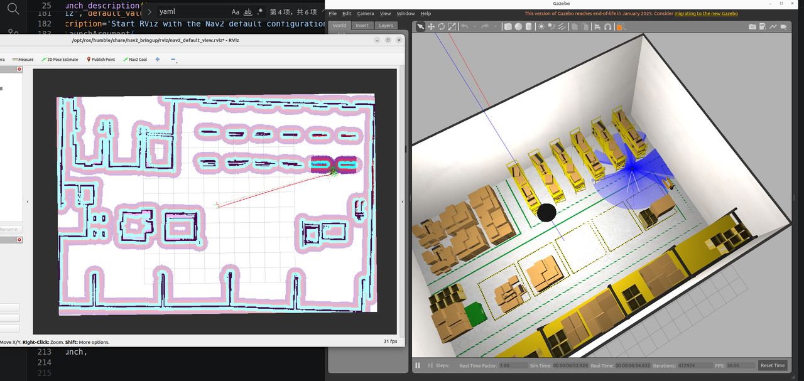

# tur_amcl_ws

## 经典仓库建图及导航仿真



## 部分调参优化说明

- `src/warehouse_navigation_exam/config/slam_mapping.yaml`：优化建图
- `src/warehouse_navigation_exam/config/amcl_localization.yaml`：定位参数优化

### AMCL 参数调整

增加估计位姿的粒子，用于应对多重复货架场景：

```yaml
max_particles: 5000
min_particles: 1000  # 原值 100
